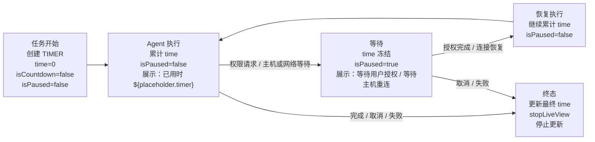

# Nexus 实况窗权益申请场景说明

## 1. 申请概览

| 项目 | 申请内容 |
| --- | --- |
| 应用名称 | Nexus |
| 应用类型 | 工具类应用：远程 AI 编程助手 |
| 本次申请的实况窗场景 | **计时** |
| LiveView 事件类型 | **`event=TIMER`** |
| 服务对象 | 发起远程代码任务的 Nexus 用户 |
| 计时含义 | 该次远程 AI 编程任务处于“Agent 执行中”的累计用时，不是倒计时，也不是系统时间展示 |
| 申请范围 | 仅申请一个 TIMER 场景；不申请交通、外卖、航班、支付、赛事或真实运动等其他场景 |

Nexus 通过手机端连接用户电脑上的 PC Bridge Server，再由 Bridge Server 调用 ACP（Agent Client Protocol）AI 编程 Agent。用户提交代码任务后，Agent 可能经历任务启动、思考与工具执行、等待用户授权、等待主机重连、恢复执行以及完成、取消或失败等状态。本申请的实况窗只把这一次远程编程任务投影为一个**工具类计时器**，帮助用户在离开 Nexus 前台后快速确认任务是否仍在执行、已经运行了多久以及下一步需要什么操作。

本材料描述 Nexus 的计时场景、节点设计与技术方案，不代表已经取得任何审核结论或额外业务权益。

## 2. 单独、具体、真实的使用场景

用户在 Nexus 手机上向当前电脑工作区的 AI 编程 Agent 发起一个代码任务，例如修复一个编译错误、补充一个功能或检查一处代码问题。Nexus 将任务通过 WebSocket 发送到 PC Bridge Server，Bridge Server 负责与 ACP Agent 通信。用户随后可能锁屏、切换到其他应用或把手机放在桌面上等待。

任务在电脑上运行期间，Agent 会进行分析并执行工具操作。若 Agent 需要用户确认一项权限，或者电脑暂时离线、Bridge Server 正在等待重连，任务本身不会继续消耗执行时间。用户从手机锁屏或系统实况窗区域看到“等待用户授权”或“等待主机重连”以及已累计用时，点击后回到 Nexus 对应任务页面处理。权限通过或主机恢复后，实况窗恢复计时并显示 Agent 继续执行。任务最终完成、被用户取消或因不可恢复错误失败时，实况窗显示相应终态并结束。

这个场景的核心是“**一次远程 AI 编程任务的执行计时**”：计时反映 Agent 实际执行的时间，等待授权和等待主机重连期间暂停，不把等待误报为执行进度。

## 3. 用户痛点与实况窗价值

### 3.1 用户痛点

1. 远程代码任务通常需要一段时间，用户不能一直保持 Nexus 在前台；反复打开应用查看状态会打断工作流。
2. 仅显示“任务进行中”的普通通知无法区分 Agent 正在执行、正在等用户授权，还是正在等待电脑恢复连接。
3. 用户看不到累计执行时长，难以判断任务是否仍然正常推进，或者是否需要回到应用处理问题。
4. 当任务结束时，用户希望先快速知道结果，再决定是否打开 Nexus 查看完整日志、代码变更或错误详情。

### 3.2 实况窗价值

1. **一眼确认状态**：在不打开 Nexus 的情况下显示“Agent 执行中”“等待用户授权”“等待主机重连”等高层状态。
2. **准确反映用时**：使用 TIMER 的累计计时能力，展示实际执行用时；暂停时不继续增长。
3. **降低处理延迟**：等待用户授权时，用户可以直接点击实况窗回到对应授权页面，避免任务长时间停留。
4. **减少无效打扰**：实况窗只呈现当前任务的必要摘要，不在锁屏或系统区域展示代码内容、命令或敏感日志。
5. **保持应用边界清晰**：实况窗是 Nexus 任务状态的轻量投影，不替代 Nexus 内的完整任务详情、权限决策和结果查看。

## 4. 节点状态与 LiveView 生命周期映射

下表是本次 TIMER 申请的完整节点设计。每个节点都能映射到 LiveView 的创建、更新、暂停、恢复或结束生命周期；不创建第二种业务场景。

| 节点 | 进入条件与数据来源 | LiveView 生命周期动作 | TIMER 字段 | 卡片展示 | 点击后行为 | 后续节点 |
| --- | --- | --- | --- | --- | --- | --- |
| **任务开始** | Nexus 收到用户提交的代码任务，Bridge Server 确认建立任务会话 | **创建**实况窗 | `time=0`；`isCountdown=false`；`isPaused=false` | “AI 编程任务”；“准备开始”；已用时 `${placeholder.timer}` | 打开该任务的 Nexus 任务详情页 | 计时中、取消或失败 |
| **计时中 / Agent 执行** | ACP Agent 已开始处理任务，状态为思考、工具执行或其他可继续执行阶段 | **更新**实况窗；在执行期间按允许频率刷新计时，状态变化立即刷新 | `time=累计活跃执行毫秒数`；`isCountdown=false`；`isPaused=false` | “Agent 执行中”；“已用时 `${placeholder.timer}`”；可附一条不含敏感内容的高层步骤，如“正在处理任务” | 打开该任务详情页，查看完整进度 | 继续计时、等待用户授权、等待主机重连、完成、取消或失败 |
| **等待用户授权** | Bridge/ACP 返回权限请求，Agent 暂停并等待用户决定 | **更新**实况窗为暂停状态 | 保留当前 `time`；`isCountdown=false`；`isPaused=true` | “等待用户授权”；“计时已暂停”；显示截至暂停时的 `${placeholder.timer}` | 回到 Nexus 对应任务的授权页面；授权或拒绝动作在 Nexus 内完成 | 恢复、取消或失败 |
| **等待主机重连** | 手机与 Bridge Server 或电脑的连接中断，任务会话明确处于等待重连状态 | **更新**实况窗为暂停状态 | 保留当前 `time`；`isCountdown=false`；`isPaused=true` | “等待主机重连”；“计时已暂停”；显示截至暂停时的 `${placeholder.timer}` | 回到 Nexus 对应任务的连接状态页，查看主机连接情况 | 恢复、取消或失败 |
| **恢复** | 用户完成授权，或 Bridge Server/电脑恢复连接，且会话确认 Agent 已继续执行 | **更新**实况窗为运行状态 | 从暂停时的 `time` 继续累计；`isCountdown=false`；`isPaused=false` | “Agent 执行中”；“已恢复”；“已用时 `${placeholder.timer}`” | 打开该任务详情页 | 继续计时、再次暂停、完成、取消或失败 |
| **完成结束** | Bridge/ACP 返回任务完成终态 | 先以最终累计时间**更新**一次，再**结束**实况窗 | 最终 `time`；`isCountdown=false`；`isPaused=false` | “已完成”；“总用时 `${placeholder.timer}`” | 打开 Nexus 的任务结果页，查看完整结果 | 终态，不再计时或更新 |
| **取消结束** | 用户在 Nexus 内取消任务，或 Bridge/ACP 返回规范化的取消终态 | 先以最终累计时间**更新**一次，再**结束**实况窗 | 最终 `time`；`isCountdown=false`；`isPaused=false` | “已取消”；“已用时 `${placeholder.timer}`” | 打开 Nexus 的任务详情页，查看取消前状态 | 终态，不再计时或更新 |
| **失败结束** | Bridge/ACP 返回不可恢复的失败终态 | 先以最终累计时间**更新**一次，再**结束**实况窗 | 最终 `time`；`isCountdown=false`；`isPaused=false` | “执行失败”；“已用时 `${placeholder.timer}`” | 打开 Nexus 的任务错误详情页，查看错误原因 | 终态，不再计时或更新 |

说明：若任务在“等待用户授权”或“等待主机重连”节点被取消或失败，结束时仍只结算此前累计的活跃执行时间，不把暂停等待时长加入 `time`。最终结果以 Bridge/ACP 会话的规范化终态为准，实况窗不自行推断“完成”或“失败”。

## 5. 生命周期流程图（Mermaid 源与 SVG 成品）

本节图示使用 Mermaid 作为可编辑源格式；附件中的 SVG 是由固定版本 Mermaid CLI 渲染的成品。图示只表达本申请的工具类远程 AI 编程任务 `event=TIMER`，不引入其他场景。



完整附件：

- [`node-design.mmd`](node-design.mmd)：节点与 TIMER 生命周期的 Mermaid 可编辑源；
- [`node-design.svg`](node-design.svg)：由固定 Mermaid CLI 渲染的节点图成品；
- [`solution-architecture.mmd`](solution-architecture.mmd)：Nexus 手机、WebSocket、PC Bridge、ACP Agent、LiveViewHelper/LiveViewKit 及数据边界的 Mermaid 可编辑源；
- [`solution-architecture.svg`](solution-architecture.svg)：由固定 Mermaid CLI 渲染的架构图成品。

渲染命令固定为：

`npx --yes @mermaid-js/mermaid-cli@11.12.0 -i <file>.mmd -o <file>.svg`

`node-design.mmd` 展示任务开始/创建、Agent 执行计时、等待用户授权或主机/网络、恢复执行，以及完成、取消、失败后的终态与停止更新；`solution-architecture.mmd` 展示手机 Nexus ↔ WebSocket ↔ PC Bridge ↔ ACP Agent、LiveViewHelper/LiveViewKit 的创建/更新/结束与点击回应用路径。两张图均只传递状态、标题和已用时长，不传递代码、密钥或完整日志。

## 6. TIMER 字段与展示内容

### 6.1 必填计时字段

本场景始终使用官方计时事件 **`event=TIMER`**，字段语义保持一致：

| 字段 | 取值与语义 |
| --- | --- |
| `event` | 固定为 `TIMER`；本申请不混用其他场景事件 |
| `time` | 以毫秒（ms）表示的累计活跃执行时间；任务开始为 `0`，暂停时冻结，恢复后继续累计，结束时记录最终值 |
| `isCountdown` | 固定为 `false`；Nexus 展示已用时间，不展示剩余时间 |
| `isPaused` | Agent 执行时为 `false`；等待用户授权或等待主机重连时为 `true`；恢复后为 `false` |
| 时间展示 | 使用官方 `${placeholder.timer}` 展示 `time` 对应的已用时 |

示意字段组合如下，实际传递还会带有用于关联本次任务的内部会话标识和安全展示文案：

```json
{
  "event": "TIMER",
  "time": 0,
  "isCountdown": false,
  "isPaused": false
}
```

### 6.2 实况窗卡片内容

卡片保持简洁，优先展示以下内容：

- 应用标识：Nexus；
- 任务高层名称：AI 编程任务；如用户提供安全的短标题，可显示该标题；
- 当前节点：准备开始、Agent 执行中、等待用户授权、等待主机重连、已完成、已取消或执行失败；
- 已用时间：`${placeholder.timer}`；
- 运行节点可显示“计时中”，暂停节点明确显示“计时已暂停”；
- 终态显示总用时，并停止继续刷新。

卡片不展示代码正文、用户完整提示词、文件路径、Shell 命令、工具输入输出、访问令牌、主机地址、权限请求的敏感参数、完整错误堆栈或 Agent 的内部思考内容。

## 7. 创建、更新、暂停、恢复与结束策略

### 7.1 创建

- 只有在用户主动提交代码任务且 Bridge Server 确认任务会话已建立后创建实况窗。
- 创建时固定使用 `event=TIMER`、`time=0`、`isCountdown=false`、`isPaused=false`。
- 一个任务会话对应一个实况窗；重复收到相同任务的创建确认不重复创建。
- 仅打开 Nexus、浏览历史任务或连接尚未建立时，不创建 TIMER 实况窗。

### 7.2 更新与计时

- 状态变化（开始执行、进入工具执行、进入等待、恢复或终态）立即更新实况窗。
- 计时中按平台允许的更新频率刷新 `time`，以保持 `${placeholder.timer}` 可读且不过度频繁更新；状态发生变化时不等待下一次周期刷新。
- `time` 按活跃执行区间累计：从进入“计时中”开始计时，进入暂停节点时结算并冻结当前区间，恢复后从冻结值继续。
- 实况窗只渲染会话状态投影，不单独发起 Agent 命令，也不自行猜测任务进度百分比。
- 更新消息带有任务会话关联信息和顺序信息；重复或过期更新不覆盖较新的状态，避免网络重连造成状态倒退。

### 7.3 暂停

- 当 ACP/Bridge 产生用户权限请求并明确进入等待状态时，更新 `isPaused=true`。
- 当 Bridge Server 或电脑连接中断且会话进入等待主机重连状态时，更新 `isPaused=true`。
- 暂停只表示等待期间停止累计执行时间，不代表删除任务或结束会话。
- 暂停卡片保留截至暂停时的 `time`，不得把等待授权或重连的墙上时间继续累加。

### 7.4 恢复

- 用户在 Nexus 内完成授权，或 Bridge Server/电脑恢复连接并确认 Agent 已继续执行后，更新 `isPaused=false`。
- 恢复使用原任务会话和同一个实况窗，`time` 从暂停时的累计值继续增长，不重新从 `0` 开始。
- 若恢复后再次需要授权或再次断开连接，按同一规则重新进入暂停节点。

### 7.5 结束

- Bridge/ACP 返回完成、取消或失败的规范化终态后，先提交一次最终 `time` 与状态更新，再调用结束生命周期。
- 结束前若任务处于暂停状态，最终 `time` 仍只包含此前的活跃执行时间。
- 结束后不再刷新 TIMER，不重复创建同一会话，也不把后续历史日志当成新的实况窗任务。
- 完成、取消和失败均属于本次 TIMER 场景的终态差异，不新增其他申请场景。

## 8. 点击行为

实况窗的点击行为统一为“回到 Nexus 处理或查看当前任务”，不在锁屏实况窗中直接执行权限批准、拒绝、取消或代码操作：

| 点击时状态 | 回到 Nexus 后的目标 |
| --- | --- |
| 准备开始 / Agent 执行中 | 打开同一任务的详情页，显示当前会话状态与进度摘要 |
| 等待用户授权 | 打开同一任务的授权页面，展示必要的安全摘要，由用户在 Nexus 内决定授权或拒绝 |
| 等待主机重连 | 打开同一任务的连接状态页，显示 Bridge/主机连接恢复情况 |
| 已完成 | 打开任务结果页，查看完整结果、代码变更或日志 |
| 已取消 | 打开任务详情页，查看取消前的状态 |
| 执行失败 | 打开任务错误详情页，查看完整错误信息 |

深链使用本次任务的内部会话标识定位页面；如果任务已结束或会话已失效，Nexus 打开相应的历史详情，不创建新的 TIMER。

## 9. 数据来源、技术方案与一致性

### 9.1 数据来源

1. **任务开始**：来自 Nexus 手机端发出的任务请求，以及 Bridge Server 对任务会话建立的确认。
2. **执行与等待状态**：来自 Bridge Server 转发的 ACP Agent 会话状态，包括 Agent 执行、权限请求和等待主机重连等状态。
3. **完成、取消、失败**：来自 Bridge/ACP 返回的规范化终态；实况窗不根据超时、网络猜测或用户是否打开卡片来推断终态。
4. **计时数值**：由 Nexus 会话计时器根据活跃与暂停状态累计，以单调时间计算区间，转换为 TIMER 要求的毫秒 `time`；数据源状态优先于实况窗本地显示。

### 9.2 技术链路

```text
Nexus 手机端
    ⇄ WebSocket
Relay / PC Bridge Server
    ⇄ ACP
AI 编程 Agent
    ↓ 会话状态事件
Nexus 状态归一化层
    ↓ event=TIMER + 安全展示文案
LiveView Kit 实况窗
```

- Flutter 侧负责接收并归一化任务会话事件，通过原生桥接把 TIMER 状态投影给 HarmonyOS LiveView Kit。
- 原生侧调用 LiveView Kit 的创建、更新和结束能力，保证 `event=TIMER` 的字段语义一致。
- 每次状态更新绑定任务会话标识；断线重连后先从服务端查询或回放当前会话，再恢复实况窗状态，避免仅依赖手机端最后一帧数据。
- LiveView 只做状态展示和点击回应用跳转，不在后台直接执行代码、调用命令或替用户完成权限决策。

### 9.3 状态一致性与异常边界

- 未收到任务会话确认时不创建实况窗；未收到明确终态时不显示“已完成”。
- 同一任务的重复事件按会话标识与顺序处理，终态更新具有幂等性。
- 手机网络暂时不可用时不伪造新的进度；恢复连接后以 Bridge/ACP 的最新会话状态校正实况窗。
- 如果任务已在服务端进入终态，重连后的实况窗只展示终态并结束，不重新开始计时。

## 10. 隐私与合规边界

1. **最小化展示**：锁屏和系统实况窗只展示 Nexus、任务高层标题、当前状态和累计时间；默认不展示代码、路径、命令、提示词或日志。
2. **敏感信息不出窗**：用户授权内容、访问令牌、密钥、主机地址、文件内容、Agent 内部思考、完整错误堆栈及其他可能包含个人或企业信息的内容只在 Nexus 内按需展示，不进入 LiveView 展示字段。
3. **数据来源受限**：实况窗仅使用当前登录用户自己发起的任务会话状态，不采集其他用户、其他设备或无关应用的数据；不新增第三方数据共享。
4. **传输与关联**：状态沿用 Nexus 已建立的鉴权 WebSocket 链路，并以任务会话标识关联；LiveView 不建立绕过 Nexus 鉴权的新网络通道。
5. **用户控制**：遵循 HarmonyOS 系统的锁屏通知与隐私展示设置；用户关闭系统相关展示能力后，Nexus 不以其他方式绕过系统设置展示任务内容。
6. **权限决策回应用**：实况窗点击只负责打开 Nexus，授权、拒绝、取消和查看详细错误均由用户在 Nexus 内完成，避免在锁屏场景暴露或误触发高风险操作。
7. **生命周期清理**：任务完成、取消或失败后结束实况窗，不持续保留或刷新已结束任务的实时数据；历史任务数据仍按 Nexus 现有会话与日志策略管理。
8. **申请边界**：本申请只针对工具类 AI 编程任务的 TIMER 实况窗展示，不把该能力包装为交通、外卖、航班、支付、赛事或真实运动服务，也不虚构尚未获得的业务权益或审核结果。

## 11. 验收标准

### 11.1 场景与事件

- [ ] 申请材料和实现只包含一个场景：远程 AI 编程任务的**计时**。
- [ ] 所有 LiveView 生命周期事件均标识为 `event=TIMER`，不混用其他场景类型。
- [ ] Nexus 的产品定位明确为工具类远程 AI 编程助手，不出现交通、外卖、航班、支付、赛事或真实运动业务描述。

### 11.2 字段与计时

- [ ] 创建、运行、暂停、恢复和结束路径均提供 `time`（单位 ms）、`isCountdown=false` 和正确的 `isPaused`。
- [ ] 计时展示使用 `${placeholder.timer}`；`isCountdown` 全流程保持 `false`。
- [ ] Agent 执行时 `time` 增长，等待用户授权或等待主机重连时 `isPaused=true` 且 `time` 冻结，恢复后从原值继续。
- [ ] 完成、取消和失败均记录最终累计活跃执行时间，结束后不再计时或更新。

### 11.3 生命周期与节点

- [ ] 用户提交任务且会话建立后创建实况窗；未建立会话不创建。
- [ ] Agent 执行、等待授权、等待主机重连和恢复均能通过更新动作映射到对应节点。
- [ ] 完成、取消和失败分别可触发最终更新与结束动作；等待状态下的取消或失败也能正确结束。
- [ ] 重复、乱序或断线重连事件不会重复创建、让计时倒退或把终态重新变为运行态。

### 11.4 展示、点击与隐私

- [ ] 卡片能区分“Agent 执行中”“等待用户授权”“等待主机重连”以及完成、取消、失败终态。
- [ ] 点击运行态、等待态和终态卡片都能回到 Nexus 对应任务页面；等待授权时进入授权页面，等待重连时进入连接状态页。
- [ ] 实况窗不展示代码正文、完整提示词、文件路径、命令、令牌、主机地址、内部思考或完整敏感日志。
- [ ] 任务终态结束后实况窗停止更新，并遵循系统锁屏隐私设置。

### 11.5 材料与图示

- [ ] 申请表可直接复制本材料中的场景描述、节点表、TIMER 字段、生命周期策略和隐私边界。
- [ ] Mermaid 源文件可编辑，SVG 由固定版本 `@mermaid-js/mermaid-cli@11.12.0` 渲染；中文标签清晰，压缩后仍可辨认，图示只表达 TIMER 场景，不引入其他业务场景。
